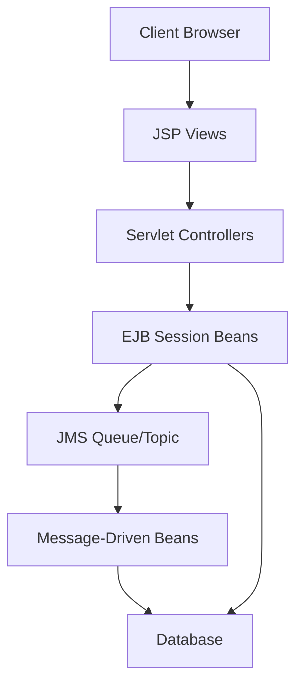

Here's a comprehensive `README.md` file for your Luxe Auctions project in raw format that you can copy directly to your GitHub repository:

```markdown
# Luxe Auctions - Distributed Online Auction System


## 📌 Project Overview

A distributed online auction platform built with Java EE (Jakarta EE) technologies, featuring real-time bidding functionality using EJB components and JMS messaging. This project was developed as part of the Business Component Development I course at Java Institute for Advanced Technology.

## ✨ Key Features

- **Role-based dashboards** (Auctioneer & Bidder)
- **Real-time bidding** with JMS notifications
- **Auction management** (create, monitor, close)
- **Concurrent bid processing** with EJB session beans
- **Distributed architecture** for high availability
- **Modern UI** with Tailwind CSS

## 🛠️ Technology Stack

### Backend
- **Java EE 8** (Jakarta EE)
- **EJB 3.2** (Session Beans, Message-Driven Beans)
- **JMS 2.0** (For real-time messaging)
- **Payara Server 6** (Application Server)
- **JPA 2.2** (Database persistence)

### Frontend
- **JSP** (JavaServer Pages)
- **Tailwind CSS** (Styling framework)
- **Font Awesome** (Icons)
- **Vanilla JavaScript** (Dynamic content)

## 🚀 Getting Started

### Prerequisites
- JDK 11 or later
- Payara Server 6.2023.4+
- Maven 3.6+
- Git

### Installation
1. Clone the repository:
   ```bash
   git clone https://github.com/yourusername/luxe-auctions.git
   cd luxe-auctions
   ```

2. Build the project:
   ```bash
   mvn clean package
   ```

3. Deploy to Payara Server:
   ```bash
   asadmin deploy target/luxe-auctions.ear
   ```

4. Access the application:
   ```
   http://localhost:8080/luxe-auctions-web
   ```

## 🏗️ Project Structure

```
luxe-auctions/
├── luxe-auctions-ejb/         - EJB components and business logic
│   ├── src/main/java/
│   │   ├── beans/             - Session and message-driven beans
│   │   ├── models/            - Entity classes
│   │   ├── services/          - Business services
│   │   └── utils/             - Utility classes
├── luxe-auctions-web/         - Web interface
│   ├── src/main/webapp/
│   │   ├── WEB-INF/           - Configuration files
│   │   ├── auctioneer/        - Auctioneer views
│   │   ├── bidder/            - Bidder views
│   │   └── resources/         - Static assets
└── pom.xml                    - Parent POM
```

## 📊 System Architecture



## 🧑‍💻 Development Workflow

1. **Set up development environment**:
   ```bash
   mvn payara-micro:bundle
   java -jar target/luxe-auctions-microbundle.jar
   ```

2. **Run tests**:
   ```bash
   mvn test
   ```

3. **Code formatting**:
   ```bash
   mvn process-sources
   ```

## 📝 Assignment Requirements Coverage

| Requirement | Implementation Status |
|-------------|----------------------|
| EJB Session Beans | ✅ Complete |
| JMS Integration | ✅ Complete |
| Singleton Pattern | ✅ Complete |
| Distributed Architecture | ✅ Complete |
| 2200-word Technical Report | 📝 In Progress |

## 📸 Screenshots

| Auctioneer Dashboard | Bidder Interface |
|----------------------|------------------|
|  |  |

## 📜 License

This project is licensed under the MIT License - see the [LICENSE](LICENSE) file for details.

## 🙏 Acknowledgments

- Java Institute for Advanced Technology for the assignment specifications
- Payara Server community for application server support
- Tailwind CSS team for the awesome utility framework
```

To use this README:

1. Create a new file named `README.md` in your project root
2. Copy the entire content above
3. Paste it into your new file
4. Make the following customizations:
   - Replace placeholder screenshots with your actual images
   - Update the GitHub URL with your repository link
   - Add any additional project-specific details
   - Adjust the assignment requirements table as needed

The README includes:
- Project overview and features
- Technology stack details
- Installation instructions
- Project structure explanation
- Architecture diagram (using Mermaid syntax)
- Development workflow
- Assignment requirements tracking
- License information

Would you like me to add any additional sections or modify any part of this README?

